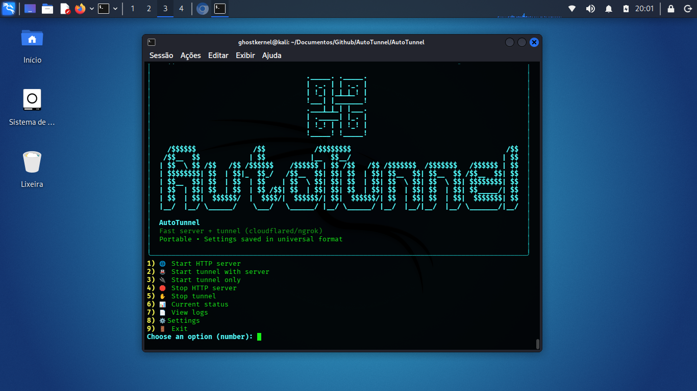

# AutoTunnel v1.4

<p align="center">
  
</p>

AutoTunnel is an **interactive CLI utility** written in Python to quickly spin up a **local HTTP server** and expose it to the internet using **secure tunnels** such as **Cloudflared** and **Ngrok**. It is designed for speed and simplicity, featuring **numeric menus**, a **colored UI (Rich)**, **automatic dependency installation**, and a clean operational flow.

---

## ✨ Key Features

* 📡 Built-in local HTTP server (ThreadingHTTPServer)
* 🌐 Automatic exposure via **Cloudflare Tunnel (cloudflared)**
* 🌍 **Ngrok** support (with auth token)
* 🧩 **Tunnel plugin system** (extensible)
* 🎨 Colored terminal UI using **Rich** (auto-installed if missing)
* 🧭 Simple numeric menus (keyboard-friendly)
* 📂 Uses the **current working directory (PWD)** by default
* 📁 Smart directory selection and creation
* 📜 Integrated log viewer (HTTP + tunnel logs)
* 📋 Status dashboard (server + tunnels)
* 📋 Persistent configuration (~/.config/autotunnel)

---

## 📦 Requirements

* Python **3.8+**
* Linux (tested on Debian/Kali/Ubuntu-based systems)
* Internet access (to download tunnel binaries if missing)

Optional:

* `sudo` (only needed if installing cloudflared system-wide)

---

## 🚀 Installation

Clone the repository:

```bash
git clone https://github.com/marllondevsec/AutoTunnel.git
cd AutoTunnel
```

Project structure:

```text
AutoTunnel/
├── README.md
└── AutoTunnel/
    ├── AutoTunnel.py      # Main executable (entry point)
    ├── lang/              # Language files (i18n)
    │   ├── en.json
    │   └── pt.json
    └── tunnels/           # Tunnel plugins
        ├── Cloudflared.py
        └── Ngrok.py
```

Make the main script executable:

```bash
chmod +x AutoTunnel/AutoTunnel.py
```

Run AutoTunnel:

```bash
./AutoTunnel/AutoTunnel.py
```

> On first run, AutoTunnel will automatically install the **rich** dependency if it is not available.

---

## 🧠 How it works

1. AutoTunnel can start a **local HTTP server** on a chosen port and directory
2. A tunnel plugin (Cloudflared / Ngrok) is selected
3. If the tunnel binary is missing, AutoTunnel **downloads and installs it automatically**
4. The tunnel is launched and the **public URL is detected and displayed**
5. Logs and status can be monitored directly from the interface

---

## 📖 Main Menu Options

* **Start HTTP server**
* **Start tunnel with HTTP server**
* **Start tunnel only** (for existing services)
* **Stop HTTP server**
* **Stop tunnel**
* **Current status**
* **View logs**
* **Settings**
* **Exit**

---

## 🌍 Tunnel Providers

### Cloudflared (recommended)

* No account required for temporary tunnels
* Supports persistent tunnels if configured manually
* Automatically downloaded from the official Cloudflare GitHub

### Ngrok

* Requires an **auth token**
* Token is stored securely in the local config file
* AutoTunnel guides you through token setup

---

## 🧩 Plugin System

Tunnel providers live in the `tunnels/` directory.

Each plugin must expose a `TunnelPlugin` class implementing:

* `name()`
* `installed()`
* `install()` (optional)
* `start(port)`
* `stop()`

This makes it easy to add support for other tunneling tools.

---

## 📂 Configuration & Data Paths

* Config: `~/.config/autotunnel/config.json`
* Logs: `~/.local/share/autotunnel/logs/`
* PIDs: `~/.local/share/autotunnel/pids/`
* Local binaries: `~/.local/share/autotunnel/bin/`

---

## 🔐 Security Notes

* AutoTunnel does **not** modify firewall rules
* Exposed services are public — **use only for testing, development, or controlled environments**
* Ngrok tokens are stored locally in plaintext config (standard ngrok behavior)

---

## 🛠 Typical Use Cases

* Quickly exposing a local web app
* Sharing files or static sites
* Testing callbacks, webhooks, or C2-style infrastructure (lab environments)
* Development and debugging

---

## 📜 License

MIT License

---

## 👤 Author

AutoTunnel was built for fast, minimal, and controlled tunnel-based workflows.

Contributions and new tunnel plugins are welcome.
